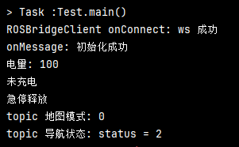

# ROS跨平台通讯文档

## 简介

此文档为 android/java 语法使用讲解文档，不涉及通讯接口文档，你需要通过解读通讯文档，然后理解消息机制，最后在本代码中实现你想对接的接口功能
（你可以理解为，本文档教你如何使用http网络请求，通讯文档只提供了 http对应的接口名字和 接口get/put请求方式 以及收发消息的解释文档）
站在巨人肩膀上眺望远方
上面是废话

## 前言

为了文档保证统一，本文基于 ubuntu开源元操作系统ros下的通讯下的 通讯文档
如果你的开发平台也是基于Ubuntu下的ros元系统开发，则不需要观看本文教程，请直接移步去看文档即可
如果你不了解ros 请继续阅读前言,ros 大神请绕过
ros 通讯机制 主要有两种：订阅发布 和 请求回调
### 订阅发布:
   - Topic: 为订阅发布的主题名，也是接口名
   - subscribe/publish: 接收指定Topic的消息/发布指定Topic的消息
   - Topic<msg extends Message>: 为sub 和 pub 收到/发布参数
### 请求回调:
   - Service: 为请求的接口名
   - call: 发起请求
   - Service<request extends Message ,response extends Message>: 请求数据类型和回调数据类型
为了实现这种机制，站在巨人肩膀上，ros官方提供了开源跨平台通讯方式，websocket 通讯方式
并且对 websocket 封装协议 为 ROSBridgeClient 实现请求回调消息的机制，使用本sdk，是需要保证sdk运行平台
在ros主机的局域网内


## 使用方式

以下是如何在从机上依据主机安装的rosbridge_suite的WebSocket端口实现ROS跨平台通讯的基本步骤：

1. 从机连接至主机的WebSocket端口：

    - 在从机上运行，连接至主机的WebSocket端口（9090）：

      ```
      ROSBridgeClient client = new ROSBridgeClient("ws://主机ip:9090");
      client.connect(new ROSClient.ConnectionStatusListener() {
            @Override
            public void onConnect() {
                Log.d(TAG, "ROSBridgeClient onConnect: ws 成功");
            }

            @Override
            public void onDisconnect(boolean normal, String reason, int code) {
                Log.d(TAG, "ROSBridgeClient onDisconnect: code " + code);

                // -1 连接不上， 1000 手机主动dis断开  1006 服务端或手机意外网络断开
            }

            @Override
            public void onError(Exception ex) {
                Log.d(TAG, "ROSBridgeClient onError: 连接异常");
                ex.printStackTrace();
            }
        });
      ```

2. 与主机进行通讯：

    - Topic:
      ```
      Topic<Message> mTopic = new Topic<Message>("TopicNames", Message.class, client);
      //注册发布消息类型
      setTargetGoalPublish.advertise();

      SetTargetGoal setTargetGoal = new SetTargetGoal();
      setTargetGoal.setGoalName(name);

      setTargetGoalPublish.publish(setTargetGoal);

      //解除注册发布类型
      setTargetGoalPublish.unadvertise();
      ```
    - Service:
      ```
      Service<Request, Response> mService = new Service<Request, Response>("/ServiceName", Request.class, Response.class, client);
      Request mRequest = new Request();
      mRequest.setData(a);// 为请求数据写入具体参数
      mService.callWithHandler(mRequest, new MessageHandler<Response>() {
           @Override
           public void onMessage(Response message) {
           // 接口结果
           }
      });
      ```
      如果参数为空请在 service中 直接使用已有的 
      com.boat.rosbridge.message.srv.std_srvs.Empty
      对象
      ```
      Service<Empty, Response> mService = new Service<Empty, Response>("/ServiceName", Empty.class, Response.class, client);
      mService.callWithHandler(new Empty(), new MessageHandler<Response>() {
          @Override
          public void onMessage(Response message) {
          // 接口结果
          }
      });
      //或者
      Service<Request, Empty> mService = new Service<Request, Empty>("/ServiceName", Request.class, Empty.class, client);
      Request mRequest = new Request();
      mRequest.setData(a);// 为请求数据写入具体参数
      mService.callWithHandler(mRequest, new MessageHandler<Empty>() {
          @Override
          public void onMessage(Empty message) {
          // 接口结果
          }
      });
      ```
    - Message: 
      为 ros通讯 自定义数据对象
      具体案例解释如下
      1. 无论是 Service 还是 Topic, 它们的通讯数据自定义对象必须继承 Message
      2. 自定义对象内的 参数必须为下列基本消息类型转换, 如果遇到自定义消息,被自定义的对象必须也继承 Message
      3. 不支持list,set ，只能用 数组 
      4. 每个字段都必须明确指定为公共字段
      // @MessageType 这里是指的通讯数据类型绝对路径 SetTargetGoal 要和 java 文件名保持一致
      如果是 service 必须加上 对应的 Request Response
      如：
      // Topic
      //@MessageType(string = "map_msgs/SetTargetGoal")
      //public class SetTargetGoal extends Message {}
      // Request
      // @MessageType(string = "map_msgs/PublishMapRequest")
      // public class PublishMapRequest extends Message {}
      // Response
      // @MessageType(string = "map_msgs/ListNaviPointsResponse")
      // public class ListNaviPointsResponse extends Message {}

      ```
      import com.jilk.ros.message.Message;
      import com.jilk.ros.message.MessageType;
      @MessageType(string = "map_msgs/SetTargetGoal")
      public class SetTargetGoal extends Message {
          public String goal_name;//具体参数
          public String getGoalName() {
            return goal_name;
          }
          public void setGoalName(String goal_name) {
           this.goal_name = goal_name;
          }
      }
      ```
    - 基本消息类型转换:
      见源码 com.jilk.ros.rosapi.message.TypeDef内数据类型
      ```
      "bool"    boolean Boolean
      "int8"    byte    Byte
      "byte"    byte    Short 
      "uint8"   short   Short
      "char"    short   Short
      "int16"   short   Short
      "uint16"  int     Integer
      "int32"   int     Integer
      "uint32"  long    Long
      "int64"   long    Float
      "float32" float   Float
      "float64" double  Double
      "uint64"  long    java.math.BigInteger
      "string"          String
      ```
      Message自定义数据类型 脱离 以上参数 需要对其继承 Message

